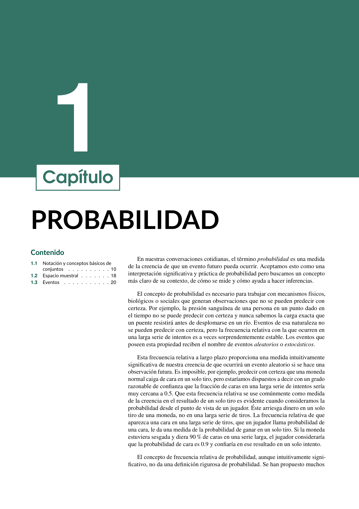
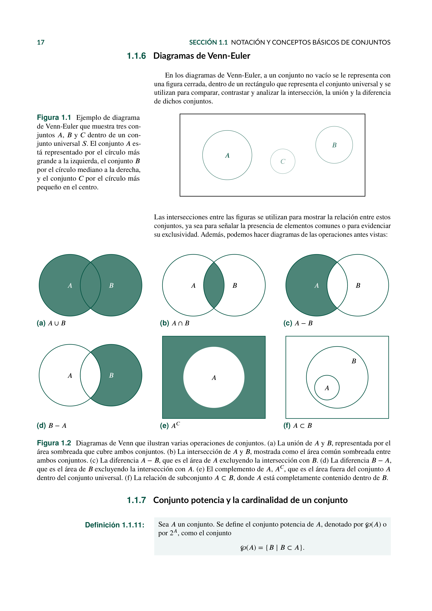

# Probabilidad

Este repositorio contiene el material y el código asociado al estudio de la **Probabilidad**, diseñado para estudiantes y profesionales interesados en el análisis de incertidumbre y la modelización de eventos aleatorios en diversos contextos.

## Contenido

### Capítulo 1: Fundamentos de la Probabilidad
1. **Definiciones y axiomas**: Principios básicos y formalización matemática.
2. **Propiedades y teoremas fundamentales**: Regla de la suma, regla del producto, etc.
3. **Espacios muestrales y eventos**: Tipos de eventos y operaciones entre ellos.

### Capítulo 2: Variables Aleatorias y Distribuciones
1. **Variables aleatorias discretas y continuas**: Definiciones y ejemplos.
2. **Distribuciones de probabilidad**: Bernoulli, Binomial, Poisson, Normal, Exponencial, entre otras.
3. **Esperanza matemática y momentos**: Media, varianza, desviación estándar y propiedades.

### Capítulo 3: Teorema de Bayes y Probabilidad Condicional
1. **Definición y aplicaciones del Teorema de Bayes**.
2. **Probabilidad condicional**: Dependencia e independencia de eventos.
3. **Modelos bayesianos y su aplicación en inferencia estadística**.

## Cómo usar

El material está disponible en formato PDF para facilitar su consulta y estudio. Puedes clonarlo o descargarlo según tu conveniencia.

## Descarga

Puedes descargar las notas haciendo clic en el enlace que se encuentra al inicio de este repositorio.

## Contribuciones

Si tienes sugerencias o mejoras, siéntete libre de abrir una *issue* o hacer un *pull request*. ¡Tu contribución es bienvenida!